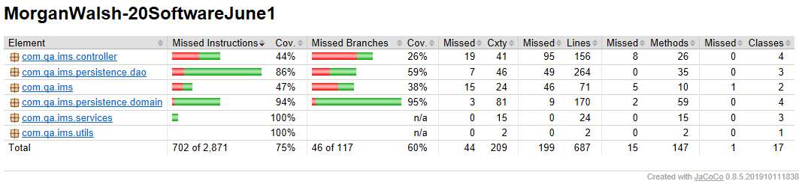

Coverage: 76.7%
# Inventory Management System (IMS)

The Inventory Management System allows you to create, read, update and delete customers, items and orders; multiple items can be placed in a single order. If you have any improvements, please make a pull request with an explanation for your code.

## Getting Started

These instructions will get you a copy of the project up and running on your local machine for development and testing purposes. See deployment for notes on how to deploy the project on a live system.

### Prerequisites

Step 1:

What things you need to install the software and how to install them
To run the software, you will need Java installed on your machine. Simply run and follow the downloaded executable, this will install Java. Make sure to 'add Java to your path'.

```
https://www.java.com/en/download/
```

Step 2:

You will also need a local instance of MySQL running, install MySQL from:

```
https://dev.mysql.com/downloads/mysql/5.7.html

```


Step 3:

Extract the downloaded .zip MySQL file to:

```
C:\Program Files\
```

Step 4:

Navigate inside the extracted file (x is dependant on the version) and create a data folder:

```
cd C:\Program Files\mysql-5.7.x\
mkdir data
```

Step 5:

Ensure you are within the directory prior used, ensure the data folder is empty and run (Allow Access to Private & Public networks if queried):

```
mysqld --console --initialize
```

Take note of the temporary password created for the default super-user 'root@localhost'.

Step 6:

Check if the server is initialised:

```
mysqld --console
```

Step 7:

Open a new command prompt and log into the server as the superuser:

```
mysql -u root -p
```

When prompted for the password, enter the temporary generated password.

Step 8:

Reset the password to 'root':

```
ALTER USER 'root'@'localhost' IDENTIFIED BY 'root';
```

Step 9:

Add MySQL as a Windows Service so it does not need to be manually activated before use:

Open an elevated command prompt, navigate back to the installation folder and run the install command:

```
cd C:\mysql-5.7.x\bin
mysqld --install
```

Step 10:

Open 'Windows Services' and find 'MySQL'. Right click and then left click 'Start'.

Step 11:

Setup the MySQL environment variable. Search for 'environment variables' and then select 'Edit the system environment variables' to open the relevant Control Panel utility.

Once 'System Properties' has opened, select 'Environment Variables' to open the 'Environment Variables' utility.

Under 'System variables', select 'New...' and enter:

```
Variable name  : MYSQL_HOME
Variable value : C:\Program Files\mysql-5.7.x
```

Where 'x' is the relevant version.

Now, select the 'Path' field under 'System variables' and click 'Edit...'. Then click 'New' in the opened utility, and enter the following:

```
%MYSQL_HOME%\bin
```

### Installing

Step 1:

```
Download the jar file, with-dependencies, from the GitHub repository:
	Navigate to: https://github.com/MrWalshyType2/ims-starting-point/tree/develop/target
```

Step 2:

```
In an elevated command line tool, navigate to the downloaded jar files storage location, then enter the following command to run:
	java -jar ./MorganWalsh-20SoftwareJune1-jar-with-dependencies.jar
```
The following shows creation of a customer, then reading of customers from the customers table in the database:


## Running the tests

Step 1:

```
To run the tests, fork the repository at:
	https://github.com/MrWalshyType2/ims-starting-point/
```

Step 2:

```
In an elevated command line tool, navigate to the downloaded repository location and run the tests with:
	mvn package
```

### Unit Tests 

Unit tests test individual methods/functionality to ensure each functions as expected. My tests return a Surefire report and executable jar files when executed, from the project root, with:

```
mvn package
```



## Dependencies

* [Maven](https://maven.apache.org/) - Dependency Management

* [JUnit](https://mvnrepository.com/artifact/junit/junit) - Unit Testing

* [Surefire](https://maven.apache.org/surefire/maven-surefire-plugin/usage.html) - Maven Testing Report Plugin

## Deployment

* To deploy this on a live database, you will need a cloud SQL database instance. GCP is the cloud system of choice here.

Step 1:

* Navigate to: [Google Cloud Platform](https://cloud.google.com/)

Step 2:

* Create an account/Login, then navigate to your GCP console.

Step 3:

* Click the hamburger menu icon in the upper left corner, and select the option 'SQL' under 'Storage'.

Step 4:

* Select '+' or '+ Create Instance' to start instance creation, then select 'Choose MySQL'.

Step 5:

* Enter the name 'ims' for the instance ID and Generate a secure password (note this down).

* Set your region to your closest region.

* Ensure the Database Version is 'MySQL 5.7'.

Step 6:

* Under 'Configuration options > Connectivity', select '+ Add Network' and enter the following CIDR notation to allow connections from any IP (whitelisting):

```
0.0.0.0/0
```

Step 7:

* Click create to create your GCP MySQL instance.

* Navigate to your overview if not already there, and copy your 'Public IP address'.

Step 8:

* In your downloaded application, modify the MySQL url in the 'utils > Utils.java':

```
<GCP_IMS_PUBLIC_IP>:3036
```

## Built With

* [Maven](https://maven.apache.org/) - Dependency Management

## Version Control

I used [GitHub](http://github.com/) for version control.

## Authors

* **Chris Perrins** - *Initial work* - [christophperrins](https://github.com/christophperrins)

* **Nick Johnson** - *Refinements* - [nickrstewarttds](https://github.com/nickrstewarttds)

* **Morgan Walsh** - *Project lead* - [morganwalsh] (https://github.com/MrWalshyType2)

## License

This project is licensed under the MIT license - see the [LICENSE.md](LICENSE.md) file for details 

*For help in [Choosing a license](https://choosealicense.com/)*

## Acknowledgments

* **Chris Perrins** - *Provided the initial project starting point.* - [christophperrins](https://github.com/christophperrins)

* **Nick Johnson** - *Refined the initial project starting point.* - [nickrstewarttds](https://github.com/nickrstewarttds)

* **Vinesh Ghela** - *A 2020JuneSoftware1 Cohort trainer who aided others, and myself, when stuck.* - [vineshghela](https://github.com/vineshghela)

* **Alan Davis** - *A 2020JuneSoftware1 Cohort trainer who aided others, and myself, when stuck.* - [alandavies](https://github.com/MorickClive)

* **Jordan Harrison** - *A Cohort trainer who dropped in here and there to give tips, tricks, and help in general.* - [jordanharrison](https://github.com/JHarry444)

* **Gianluca Fernandez** - *Provided knowledge of the keyword SCHEMA rather than DATABASE for MySQL*


